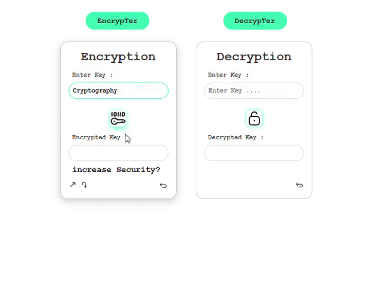

# Project Title : Encryptify
This project is an encryption and decryption tool built to securely encrypt and decrypt messages or keys using multiple layers and levels of encryption algorithms.
## Team Members         
* **Bharath Kumar SB [1OX22CS036]**
* **Bharath Raj H [1OX22CS037]**
* **Dharshan M [1OX23CS404]**

# Description
 The goal of this tool is to provide flexibility in encryption strength, offering different levels of encryption for users depending on their security needs. The project uses JavaScript as the primary programming language, with integrated cryptographic algorithms like AES, custom XOR shifts, and hash-based encryption.

The tool offers four levels of encryptionb**Easy, Medium, Hard, and Black** each designed with varying complexity and security strength. It allows users to input text, encrypt it at their desired level, and then decrypt it if allowed.

### Levels of Encryption:
**1. Easy Encryption (AES - Advanced Encryption Standard):**
   - The easy level uses a layered AES encryption algorithm with two secret keys.
   - Use Case: Suitable for general-purpose encryption where both performance and security are balanced.

**2. Medium Encryption (Custom XOR with Base64):**
   - The medium level combines a basic encryption algorithm using shifts and XOR operations, followed by Base64 encoding.
   - Decryption: The encrypted Base64 string is decoded, then each character is XORed and shifted back to retrieve the original message.
   - Use Case: Suitable for lightweight security requirements where performance is prioritized over encryption complexity.

**3. Hard Encryption (Hashing with SHA, MD5):**
   - The **hard level** uses multiple hashing algorithms, including **MD5, SHA-512, SHA-1, and SHA-256**, to create a non-reversible encryption process.
   - Decryption: Not allowed, as this encryption method is one-way only.
   - **Use Case**: Suitable for storing passwords or sensitive data where decryption is not required, but verification through comparison is needed.

**4. Black Encryption (Basic XOR Shift):**
   - The black level is a simple yet effective encryption method using a fixed shift and XOR operation.
   - Decryption: The process is reversed by XORing the encrypted characters and then shifting them back to retrieve the original message.
   - Use Case: Suitable for obfuscation purposes where security is not a critical concern, such as internal data masking or simple encoding.

## Tech Stack:
   - HTML/CSS: For the structure and styling of the application.
   - JavaScript: To handle the encryption/decryption logic and dynamic behavior on the frontend.
   - CryptoJS: A JavaScript library used for implementing cryptographic algorithms like AES (Advanced Encryption Standard).
   - Base64 Encoding/Decoding: Used for certain encryption and decryption processes.

# Demo

## Steps to run the Project 
1. Run ``npm install ``
2. Open ``index.html`` 
3. Press ``Alt+B``
   

